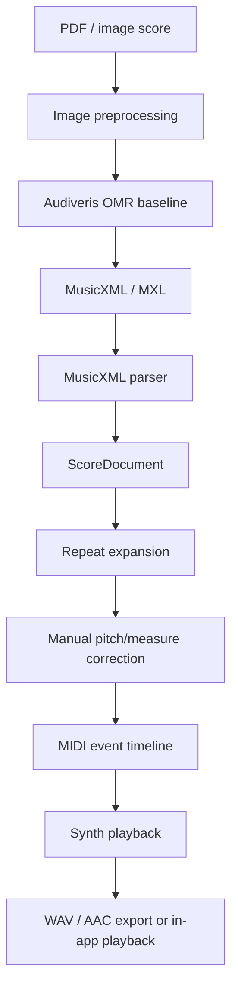

# Shenghai Architecture

## MVP Pipeline



## Apple App Architecture

The app should be built primarily in Xcode with SwiftUI and shared Swift code for iPhone, iPad, and macOS.


## Core Data Objects

- `ScoreDocument`: Shenghai project wrapper.
- `Part`: one musical part or voice.
- `Measure`: measure-level score structure.
- `Note`: pitch, octave, duration, voice, staff, and timing metadata.
- `Correction`: user edits after OMR.
- `ExpandedMeasure`: playback-order measure reference after repeats/endings.
- `PlaybackEvent`: MIDI-like event timeline.

## Current Xcode Implementation

The first Xcode-facing module is a Swift package:

```text
ios-app/ShenghaiCore/
├── Package.swift
├── Sources/ShenghaiCore/
│   ├── ScoreDocument.swift
│   ├── MusicXMLImporter.swift
│   └── MIDIWriter.swift
└── Tests/ShenghaiCoreTests/
    └── ShenghaiCoreTests.swift
```

This package is intentionally UI-free. It should be embedded into future app targets:

- `Shenghai iOS`: iPhone and iPad SwiftUI app.
- `Shenghai macOS`: Mac SwiftUI app for richer score correction.
- Shared `ShenghaiCore`: import, correction, playback timeline, and data persistence logic.

The app layer should focus on file picking, score preview/correction UI, practice mode, and playback controls. The core package should own parsing and playback timeline generation.

## MVP Boundary

First, prove the pipeline after MusicXML. Then add OMR automation.

1. Parse MusicXML.
2. Create ScoreDocument JSON.
3. Generate playable MIDI.
4. Add repeat expansion.
5. Integrate Audiveris OMR.
6. Build Xcode UI for review and correction.
