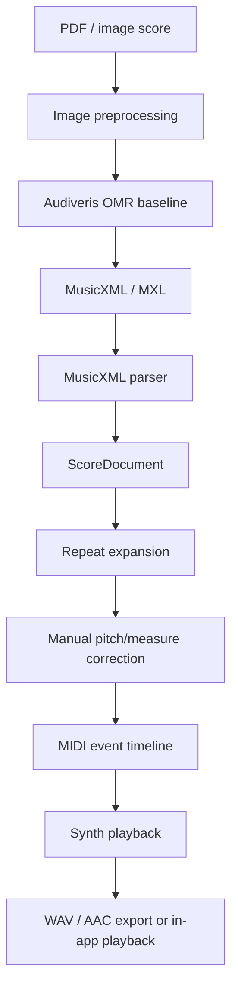
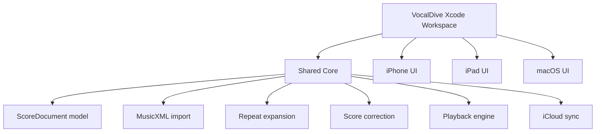

# VocalDive Architecture

## MVP Pipeline



## Apple App Architecture

The app should be built primarily in Xcode with SwiftUI and shared Swift code for iPhone, iPad, and macOS.



## Core Data Objects

- `ScoreDocument`: VocalDive project wrapper.
- `Part`: one musical part or voice.
- `Measure`: measure-level score structure.
- `Note`: pitch, octave, duration, voice, staff, and timing metadata.
- `Correction`: user edits after OMR.
- `ExpandedMeasure`: playback-order measure reference after repeats/endings.
- `PlaybackEvent`: MIDI-like event timeline.

## Current Xcode Implementation

The current Xcode-facing app is:

```text
ios-app/VocalDive.xcodeproj
└── VocalDive scheme
```

It compiles the shared core and SwiftUI app shell into one Alpha app target for iPhone, iPad, and macOS. The same source also remains available as a Swift package product for fast core/app iteration:

```text
ios-app/VocalDiveCore/
├── Package.swift
├── Sources/VocalDiveApp/
│   ├── App/
│   ├── Models/
│   ├── Services/
│   ├── Stores/
│   ├── Support/
│   └── Views/
├── Sources/VocalDiveCore/
│   ├── ScoreDocument.swift
│   ├── MusicXMLImporter.swift
│   ├── MIDIWriter.swift
│   └── PitchAnalysis.swift
└── Tests/VocalDiveCoreTests/
    └── VocalDiveCoreTests.swift
```

The Alpha app layer currently owns:

- file picking for MusicXML
- demo score loading
- score summary and measure/note inspection
- MIDI playback/export actions
- pitch-feedback preview states
- research and blocker status

The core package still owns parsing, pitch analysis primitives, and playback timeline generation.

## Research-Driven Audio Analysis Interfaces

The singing research notes point to a replaceable audio-analysis architecture:

- `PitchTracking`: abstraction for YIN, pYIN, CREPE, Basic Pitch, or future Core ML models.
- `PitchContourSmoothing`: filters octave jumps, low-confidence frames, and jitter before showing feedback.
- `PitchDeviationAnalyzer`: compares sung pitch samples against score targets and labels in-tune/sharp/flat/low-confidence states.

This keeps the MVP honest: if the pitch detector is uncertain, the UI can show uncertainty instead of presenting a false red error.

## MVP Boundary

First, prove the pipeline after MusicXML. Then add OMR automation.

1. Parse MusicXML.
2. Create ScoreDocument JSON.
3. Generate playable MIDI.
4. Add repeat expansion.
5. Integrate Audiveris OMR.
6. Add score correction UI.
7. Add live microphone pitch tracking.
