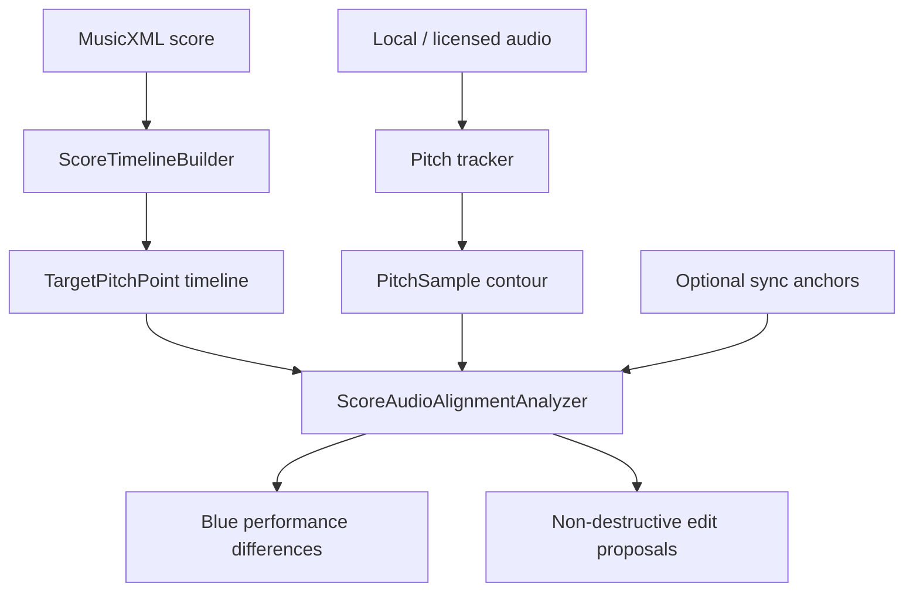

# YouTube / Score Audio Alignment Plan

Date: 2026-06-06

## Status

The YouTube alignment product feature is not complete yet, but the core alignment layer is now implemented for safe audio sources:

- local audio files
- user recordings
- licensed remote audio
- YouTube reference links, without extracting or downloading the audio stream

The app should not ship a general "download YouTube as MP3" feature. YouTube can be used as a reference or embedded playback surface where permitted, but score comparison and audio modification should run on user-provided or licensed audio.

## Product Goal

User flow:

1. Import a score as MusicXML, or run OMR first and convert the black score image/PDF into MusicXML.
2. Import a local/licensed audio file or record a rehearsal take.
3. Optionally attach a YouTube URL as reference metadata.
4. Build a target pitch timeline from the selected score part.
5. Track pitch and onset timing from the audio.
6. Compare the audio contour against the score timeline.
7. Mark score/audio differences in blue.
8. Let the user decide whether to accept edit proposals.

Blue means "reference audio and score disagree; please confirm." Red should remain reserved for live practice mistakes by the singer.

## Legal / Platform Boundary

Do not implement:

- automatic YouTube MP3 download
- separating YouTube video and audio
- modifying YouTube audio
- background playback of separated YouTube audio

Allowed safer alternatives:

- store YouTube video ID / URL as a reference
- open or embed YouTube playback through official player behavior
- align MusicXML against user-uploaded local audio
- align MusicXML against the user's own singing recording
- align MusicXML against licensed rehearsal tracks

This keeps the same technical direction while reducing App Store and copyright risk.

## Implemented Core Types

Added in `PitchAnalysis.swift`:

- `AudioSourceKind`
- `AudioSourceReference`
- `AudioScoreSyncAnchor`
- `PerformanceDifference`
- `AudioEditProposal`
- `ScoreAudioAlignmentAnalyzer`

`ScoreAudioAlignmentAnalyzer` currently detects:

- pitch difference
- timing/onset difference
- missing pitch

It outputs blue `PerformanceDifference` values and non-destructive `AudioEditProposal` values:

- pitch differences become pitch shift proposals
- timing differences become time stretch proposals

## Algorithm MVP

Current deterministic baseline:



Near-term upgrade:

- onset detection from audio energy envelope
- tempo curve estimation
- dynamic time warping between score events and audio events
- ritardando / accelerando detection
- articulation detection for tenuto, staccato, slur, and phrase endings

## How It Supports The Requested Feature

Requested: import score and YouTube video, locally download MP3, mark rhythm and pitch differences in blue, then let the user autotune timing and pitch.

Safer VocalDive version:

- Import score.
- Attach YouTube as reference link.
- Ask user to provide an owned/licensed audio file or record audio.
- Run score-audio alignment locally.
- Mark rhythm/pitch differences in blue.
- Generate edit proposals.
- Keep edits non-destructive until the user accepts them.

## Validation

Added tests:

- `detectsScoreAudioPitchAndTimingDifferences`
- `mapsScoreAudioAnchorsWhenComparingReferenceAudio`

Validation command:

```bash
env CLANG_MODULE_CACHE_PATH=.build/ModuleCache swift test --disable-sandbox --scratch-path .build/spm
```

Result:

- 8 tests passed.

## Next Implementation Steps

1. Add an audio import screen for local audio files.
2. Decode audio to PCM with AVFoundation.
3. Run `YINPitchTracker` over the decoded samples.
4. Feed the pitch samples and score target timeline into `ScoreAudioAlignmentAnalyzer`.
5. Draw blue marks on the vector score workspace.
6. Store accepted edit decisions in `ScoreDocument`.
7. Add a later DSP layer for pitch/time correction on user-owned audio only.
